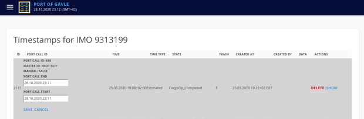
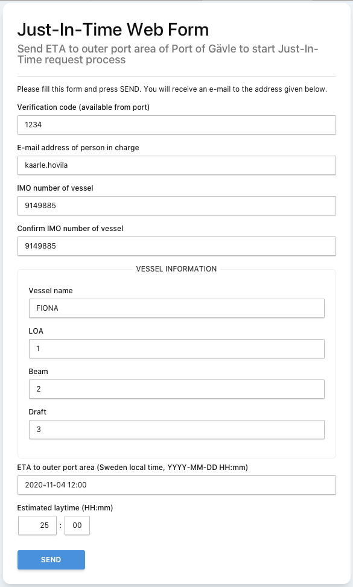
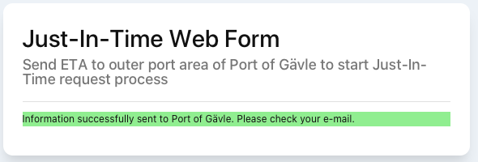
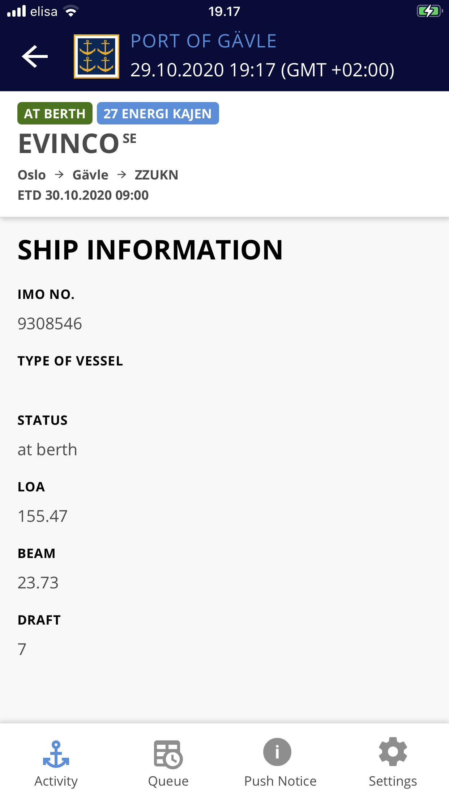

# Port Activity Application User manual

- [Port Activity Application User manual](#port-activity-application-user-manual)
  - [Introduction](#introduction)
  - [Web user interface](#web-user-interface)
    - [Basic actions](#basic-actions)
      - [Login](#login)
      - [Registration](#registration)
      - [Reset password](#reset-password)
      - [Navigation between sections and functions](#navigation-between-sections-and-functions)
    - [Activity](#activity)
      - [Activity view](#activity-view)
        - [Pin vessel](#pin-vessel)
        - [Add timestamp](#add-timestamp)
        - [Send notification](#send-notification)
        - [Send notification (STM)](#send-notification-stm)
        - [Recommend time (STM)](#recommend-time-stm)
      - [Vessels view (administrative view)](#vessels-view-administrative-view)
        - [Hide / Show](#hide--show)
        - [Show timestamps](#show-timestamps)
        - [Attach orphans timestamps](#attach-orphans-timestamps)
        - [Rebuild port calls](#rebuild-port-calls)
        - [Delete timestamp](#delete-timestamp)
        - [Show timestamp](#show-timestamp)
        - [Edit timestamp start and end range](#edit-timestamp-start-and-end-range)
      - [Inbound vessels view (STM)](#inbound-vessels-view-stm)
      - [Other ports view (STM)](#other-ports-view-stm)
      - [VIS vessels view (STM)](#vis-vessels-view-stm)
        - [Poll VIS service](#poll-vis-service)
        - [View VIS service configuration](#view-vis-service-configuration)
        - [Find VIS service](#find-vis-service)
        - [Notifications](#notifications)
          - [Show VIS notifications from other systems](#show-vis-notifications-from-other-systems)
          - [Sent TXT](#sent-txt)
          - [Recv TXT](#recv-txt)
          - [Sent VP](#sent-vp)
          - [Recv VP](#recv-vp)
          - [Send TXT](#send-txt)
          - [Send RTA](#send-rta)
        - [Port call timesheets](#port-call-timesheets)
          - [View all timestamps collected to that port call (+ sign)](#view-all-timestamps-collected-to-that-port-call--sign)
          - [View final timesheet](#view-final-timesheet)
          - [You can manually close port call](#you-can-manually-close-port-call)
          - [Re-scan port call](#re-scan-port-call)
      - [Logistics](#logistics)
      - [Notifications](#notifications-1)
      - [Users, registration and registration codes](#users-registration-and-registration-codes)
        - [Users](#users)
          - [Add new user](#add-new-user)
          - [Edit user data](#edit-user-data)
          - [Delete user](#delete-user)
        - [Registration codes](#registration-codes)
          - [Add new codes](#add-new-codes)
          - [Enable/disable code](#enabledisable-code)
          - [Delete code](#delete-code)
        - [Access control](#access-control)
        - [String translations](#string-translations)
      - [API](#api)
        - [API keys](#api-keys)
          - [Add API key](#add-api-key)
          - [Enable/disable API key](#enabledisable-api-key)
        - [API key priorities](#api-key-priorities)
      - [Modules](#modules)
      - [Queue](#queue)
      - [Berths](#berths)
        - [Add new berth](#add-new-berth)
        - [Edit berth](#edit-berth)
        - [Delete berth](#delete-berth)
        - [Make berth nominatable](#make-berth-nominatable)
      - [Queue - Just-In-Time-Arrival](#queue---just-in-time-arrival)
        - [Nominations](#nominations)
          - [Add new nomination](#add-new-nomination)
          - [Edit nomination](#edit-nomination)
          - [Delete nomination](#delete-nomination)
          - [Admin nominations](#admin-nominations)
          - [Slot requests](#slot-requests)
        - [Berth reservations](#berth-reservations)
      - [Just-In-Time Web Form](#just-in-time-web-form)
        - [Empty form](#empty-form)
        - [Example of filled form](#example-of-filled-form)
        - [After send you will see confirmation](#after-send-you-will-see-confirmation)
        - [And receive email with link to the slot received from port](#and-receive-email-with-link-to-the-slot-received-from-port)
        - [Form view to confirm and specify JIT ETA to given RTA window](#form-view-to-confirm-and-specify-jit-eta-to-given-rta-window)
        - [Filled JIT ETA and confirmation message](#filled-jit-eta-and-confirmation-message)
        - [And email confirmation of slot](#and-email-confirmation-of-slot)
      - [Sign out](#sign-out)
  - [Mobile user interface](#mobile-user-interface)
    - [Login, registration and forgot password](#login-registration-and-forgot-password)
    - [Activity](#activity-1)
      - [Pin/Unpin vessel](#pinunpin-vessel)
      - [Ship information](#ship-information)
      - [Add new timestamp](#add-new-timestamp)
      - [Send notification](#send-notification-1)
    - [Queue](#queue-1)
    - [Logistics](#logistics-1)

## Introduction

This manual briefly describes different views and functionalities of Port Activity Application. Application is accessible from web with web browser. Mobile application is available from app stores. Most common functions are accessible with mobile phones. Complex functions and more rarely used functions are available only from web application.

API of application can be integrated directly to third party application and data export can be exposed to other systems as well. API documentation however is not in the scope of this document.

## Web user interface

Web application contains all functions of application. Some functions are only for administrative tasks and are used only when setting up application or more complex analysis of data is required to see the actual data behind simpler user interfaces that are delivered for basic users.

### Basic actions

#### Login

You need an username and password to be able to login into the application. Account is created within an another user that has sufficient permission within the application. User can also use specific registration code to create account.


#### Registration

Registration for can be used to create account into the application. Use registration code to create account and fill all required information. It is not necessary to use email as username. However that you are allowed to reset your password in case of lost password you should use email as your username.


#### Reset password

There is also link to reset password. If email is used as password link to reset password is sent to that email address.

#### Navigation between sections and functions

After login activity view open by default. Clicking to the top right corner of page opens a menu that can be used to navigate between sections.


### Activity

#### Activity view


In activity view user see all active port calls. Port call is spliced into card and timeline. Card shows

- status of the port call,
- berth name (if in berth),
- vessel name,
- IMO number,
- port where vessel is coming from and
- port where vessel is going after leaving berth.

Depending of the status of port call card also shows estimated time of arriving (ETA) or estimated time of departure in the card. Below of the card is timestamps that are related to the port calls. First blue part indicates events that happen before the vessel in the port. White part indicates events that happens within the port. Lower blue part indicates events that happens after vessel is leaving port. The green line that goes through timeline indicates the state that is currently active within the port call.

Actions that user can perform for port call in this view are visible when card view is opened. Actions depends permission that user has. Possible actions are:

##### Pin vessel

When vessel is pinned you see it card as yellow and small pin on top corner of card. You can pin or unpin vessel using this pin icon. When vessel is pinned user will get UI notifications from that vessel. Notification can be that new timestamp is received for that vessel or someone has send special text notification related to that ship. If user uses mobile application with smart phone all notifications are send also as push notification to her or his devices.


##### Add timestamp

User can add manually timestamp for a port call. However most cases adding timestamps manually is not recommended since all information should come from external datasources.

##### Send notification

User can send notification that relates to that specific vessel. Notification are only within this application and any one who sees it must have account wihtin this application.

##### Send notification (STM)

STM vessels are vessels that are connected with Port Activity Application with SeaSwim/VIS connector. When vessel is STM capable this functions is visible. When sending STM notification it means that that notification goes directly to ECDIS as a “text message” that is visible for ECDIS operator in the vessel.

##### Recommend time (STM)

STM vessel can also be communicated by sharing voyage plan with recommended time of arrival (RTA) with the vessel. If vessel is known as STM vessel there is also small badge indicator in card “VIS”. That basically means that vessel is sharing its voyage plan with this application. See more STM information in chapter “VIS vessels”.

#### Vessels view (administrative view)

Vessels views is administrative view to review all vessels within the system and review timestamps received. You can search vessels be name or IMO.


For each vessel there is functions

##### Hide / Show

This hides the vessel from activity timeline. Lets say that for some reasons there is coming data from tugs that are actively coming feed timestamps from data sources but it is not something that you want to show in timeline. Then you should hide that vessel. Hidden vessel can be set back to visible by clicking “Show”.

##### Show timestamps

Shows every timestamp for a vessel that is received. This view is mostly used review raw data that is in system to validate that port call has is correct data.

##### Attach orphans timestamps

Some rare cases there is situation that IMO related timestamps is not valid for any port call yet. This function allows to manually re-scan orphan timestamps to attach those into port call. This function should be used only rarely most cases only in the beginning of setup phase when application is set up to quickly test data sources

##### Rebuild port calls

This rebuild all port calls for a vessel. Should be used with caution only in case that port calls are known to be build wrong eg. in the situations of changed logic to build port call.


When viewing timestamps for a vessels there is more functions for a single timestamp. You can

##### Delete timestamp

This removed timestamp from system. Let's say that there is false timestamp coming from any data source because of human error you should be able to remove timestamp manually.

##### Show timestamp

Show all details for a timestamp in raw format. Eg. in some situations it is informative for an administrator to see payload of a timestamps. Payload content affects how timestamp is treated within application and what extra information there is available. This is very useful while debugging timestamps and data sources that are connected to application.

##### Edit timestamp start and end range

When clicked port call id you can edit port call time range. Time range defines what timestamps are included in a port call. You can change range manually but most cases you should not. If port call Master ID is set port call time range obeys port call ETA - ETD range from an external data source that provides ETA and ETD.



#### Inbound vessels view (STM)

Inbound vessels view shows all vessels that are leaving to your port from any other port that has installed this application. Lets say that there is Port of Gävle and Port of Rauma and both have installed and registered Port activity application with SeaSWIM/VIS. If vessels leaves Rauma to Gävle then Port Activity Application of Rauma send information to Port Activity Application of Gävle about estimated time of departure (ETD). This is simple list view to show ETDs from any other ports.

#### Other ports view (STM)

This view shows what other port activity applications, or ports, are communicating with this application. Be default all port to port communication is allowed yet you can disable messages from another port.

#### VIS vessels view (STM)

This is administrative view for all VIS/STM vessel related communications. More about STM vessel can be read from [STM https://www.seatrafficmanagement.info/projects/stm-validation/


Here is all known vessels and ports with STM capabilities listed. You can use SeaSWIM/VIS raw functions to communicate with vessel. Basic users should however use function in activity view for that communication. In this view administrator can

##### Poll VIS service

Poll VIS service to fetch all latest data sent to this application

##### View VIS service configuration

See how VIS is configured for this application (how this application is connected and basically who you are in terms of VIS)


##### Find VIS service

Find VIS services by IMO or service id


##### Notifications

###### Show VIS notifications from other systems

###### Sent TXT

View sent text message from this application

###### Recv TXT

View Received text messages for this VIS instance

###### Sent VP

View sent voyage plans from this application

###### Recv VP

View received voyage plans from this application

###### Send TXT

Sent TXT message to another STM/VIS service


###### Send RTA

Send RTA for another STM/VIS vessel. Send RTA modifies received voyage plan (VP) so that planned route is within recommended time in a certain point near by port (usually outer port area). Voyage plan is send back to vessel. If new voyage plan is ok for vessel it can activate it. New voyage plan is send back to PAA and new timestamp is generated into system from that voyage plan. You can send also range for recommended time of arrival.

##### Port call timesheets


If port call timesheets view you can search vessels and see all port calls. For each port call you can

###### View all timestamps collected to that port call (+ sign)

###### View final timesheet

View timesheet in web or print it or download it as CSV file

There is also links to see all timestamps and all port calls

###### You can manually close port call

Sometimes application receives timestamps that indicates a port call. However port call could be cancelled. From cancelled port call some data sources fails to give information about cancel and port call will never finish since there is no further activity for it. In such cases you should just close port call manually.

###### Re-scan port call

Many port call extra data are collected from payloads received within timestamps. Re-scan is done automatically when new timestamp are received. However if new version of application is installed or there is doubt that timestamps are changed within port call you may want to run re-scan for it. Data collected form timestamp payloads are

* from_port = Where the vessel is coming from (format UNLOCODE)
* to_port = Where the vessel is going to (format UNLOCODE)
* next_port = Where the vessel is going next when it departs from to_port (format UNLOCODE)
* call_sign = Vessel call sign
* mmsi = Vessel MMSI number
* gross_weight = Vessel gross weight
* net_weight = Vessel net weight
* vessel_loa = Vessel LOA
* vessel_beam = Vessel beam
* vessel_draft = Vessel draft
* source = Source of data, eg. "Live_ETA"

#### Logistics

Logistics module is separate part of application. This tracks truck traffic within a gate in the port. Logistics are not linked to vessel traffic yet in any manner. It simple truck gate monitoring.


#### Notifications

Notifications are simple text messages within application. Notification can be related to a vessel or to be generic port related message. You see messages in notifications view. To send vessel related notification open timeline card of vessel and use “Send notification” button. From this view you can only send port related notification.


#### Users, registration and registration codes

##### Users


In users view you can search and view all users. You can also

###### Add new user

###### Edit user data

Edit user role, name and change password


###### Delete user

User is marked as removed and data is anonymised within system. All manually added timestamps and notifications remains in the system.

##### Registration codes


Registration code is special code that can be used to register into the application. So there is two ways to get account into the application

* Ask application administrator to add account for you or
* Ask registration code into application and create your own account

Registration code defines user role that user gets by default. With this view you can

###### Add new codes

###### Enable/disable code

###### Delete code

##### Access control


There are several roles within system. For each role has permission. Permission name more or less describes what user can do. Eg. if user belongs to role “second administrator” he can do most of things that “administrator” role gives permissions but not manage admin user or manage translations.

Roles are static within system but permission for each roles can be altered.

##### String translations


Almost all texts in application can be altered. There is default text that is key for that translation. Translation is used in user interfaces when given. Only one translation is supported currently. This allows different ports to use their own terminology for all texts and timestamps. Timestamp naming follows by default IALA S-211 standard. However it is more convenient ports to use shortening for these. Eg. in screenshot above “Actual Arrival Vessel AnchorageArea” is simple translated to  “ATA Anchorage”.

#### API

##### API keys


In this view you can

###### Add API key

This creates new API key with a given name. Api key is always bound as a user within the system since all data changes in the system are tracked on user level.

###### Enable/disable API key

If API key is disabled it can’t be used to make API calls.

API keys are keys that permits doing REST API calls to the system. Eg. external data sources can post  data into the system using API key and doing a simple post into the system:

```shell
curl 'https://your.port.com/agent/rest/timestamps' \
-XPOST \
-H 'Accept: application/json, text/plain, */*' \
-H 'Content-Type: application/json;charset=utf-8' \
-H 'Authorization: ApiKey xxx' \
-H 'Connection: keep-alive' \
--data-binary '{"imo": "9295347", "vessel_name": "ADVANTAGE PARK", "time_type": "Estimated", "state": "Departure_Vessel_Berth", "time": "2020-10-16T01:00:00.867Z", "payload": {"from_port":"FIHKI", "to_port": "SEGVX", "next_port":"FIRAU"}}'
```

This is actually base to whole application that there are several data sources that posts timestamps into the system. Those timestamps then forms port calls that are displayed in the activity timeline.

##### API key priorities


API keys can be priorities on timestamp level. If multiple data sources post same timestamps and some system gives more accurate or important data then lower priority data source can’t override higher priority source timestamps. If timestamp needs to have priory set in this view to allow receiving timestamps into the application.

#### Modules


In modules view you can enable or disable modules that are available in system. This document covers only Activity Module, Logistics Module and Queue. Modules are build functionalities that enabled and disabled certain function in system. Eg. if logistics module is disabled it is not visible in UI and also API calls related to that module are disabled.

#### Queue

Queue module allows giving predefined time slots for vessels that are coming into the port. All nominated vessels gets automatically best possible time slots that are available in the port. Procedure is

Consignee make nomination for a vessel for a certain time range and for a certain berths

* Vessel informs its ETA and laytime with Just-in-time form
* Vessel gets best possible slot times
* Vessel confirms slot time
* Optionally vessel informs new ETA and laytime with Just-in-time form and gets new slot time

#### Berths


In this all port berths are defined. In this view you can

##### Add new berth

##### Edit berth

##### Delete berth

##### Make berth nominatable

#### Queue - Just-In-Time-Arrival


Queue view show status of queue. For each slot request there is visible

* Place in queue
** Vessel name
* ETA
  * Original ETA informed by vessel
* RTA
  * RTA that was given for vessel
* JIT ETA
  * ETA that vessel has confirmed
* Live ETA
  * Live ETA that received into application from another integrated source
* PTD
  * Planned time departure when vessel is planned to leave berth
* Berth
* Status of slot reservations

There is also status of slot request and berth name in list. Also statuses green “ok”, yellow “warning” and red “late” are displayed in this view to indicate current status of how vessel is meeting JIT ETA.

##### Nominations


In this view you see all nominations made for vessels. This view is for any one with consignee permission where consignee sees his own nominations. You can

###### Add new nomination


###### Edit nomination

###### Delete nomination

###### Admin nominations


This view is for administrators to view all nominations. Administrator can add, edit or delete all nominations.

###### Slot requests


In this view is list af all slot request and related information. Slot request are communicated with JIT-ETA form by vessels that are arriving to port. Slot request has following information:

* Email
  * Email of whom make the slot request. This email address is used for communication between this application and the vessel - or who is using JIT-Form to communicate ETAs and laytimes.
* IMO
* Vessel name
* ETA
  * Original ETA vessel has estimated with JIT-form
* RTA start
  * Recommended time of arrival window start time
* RTA end
  * Recommended time of arrival window end time
* Laytime
  * How long vessel is staying at berth
* JIT ETA
  * Just-in-time ETA that vessel has confirmed based on RTA window
* Berth
  * Name of berth that vessel is arriving
* Request status

Possible statuses and descriptions

* Requested - ETA information sent by vessel
* No nomination found - Cannot find nomination for slot request
* No free slots - Cannot find free slot for slot request
* Offered - RTA window offered to vessel
* Accepted - JIT ETA sent by vessel
* Updated by port - JIT ETA updated by port
* Cancelled by vessel - Reservation cancelled by vessel
* Cancelled by port - Reservation cancelled by port
* Completed - Reservation completed

##### Berth reservations


In this view you see reservations per bert. Port can add berth blocks to block reservations for specific time into that berth.

#### Just-In-Time Web Form

Queue system requires that vessels inform their ETA with JIT Web Form. Web form default location is in URL https://yourappdomain.com/agent/eta/. Vessel fills up data and sends it and there is nomination for that vessel you will get email to confirm your request. Email is send into that email address given into field “E-mail address of person in charge”.

##### Empty form


##### Example of filled form



##### After send you will see confirmation



##### And receive email with link to the slot received from port


##### Form view to confirm and specify JIT ETA to given RTA window


##### Filled JIT ETA and confirmation message


##### And email confirmation of slot


Now vessel has confirmed slot and has place in queue to berth.

#### Sign out

Signs user out from application. When using shared computer sign out should be always performed since session time to live is days.

## Mobile user interface

Separate mobile application are available for each port that is implemented this application. While writing this there are Port Activity Gävle and Port Activity Rauma applications for ready to install from Apple Store for iOS mart phones and from Play Store for Android smart phones. After installation of application is ready to use. Mobile application have only limited subset on functionality compared to web application. For basic users mobile application is main platform to use. All basic functionality required for port actors are there. You can follow port activity, follow logistics and use notifications for communication.

### Login, registration and forgot password

Login, registration and forgot password work similar as in web version. Layout is just different.


### Activity


Activity view show first only card for each port call. Clicking card opens timeline of port call. When timeline is opened there is more functions on card. You can

#### Pin/Unpin vessel

When vessel is pinned you get notifications in to UI of changes for that vessel. If application is background in your smart phones you get push notification that is displayed on your smart phone. How push notifications are displayed in your phone depends on smart phone itself (iOS vs. Android vs. version of platform) and notification settings. There are many reasons why you may not get push notification to your smart phone. Eg. in case of low battery mode in Android platforms getting push notifications is disabled.

#### Ship information



Here you see briefly more vessel related information.

#### Add new timestamp

If you have enough permission you also can add timestamps manually


#### Send notification

Notification related to vessel can send in this view


### Queue


Queue view show status of queue. For each slot request there is visible

* RTA
  * RTA that was given for vessel
* JIT ETA
  * ETA that vessel has confirmed
* Live ETA
  * Live ETA that received into application from another integrated source
* PTD
  * Planned time departure when vessel is planned to leave berth

There is also status of slot request and berth name in list. Also statuses green “ok”, yellow “warning” and red “late” are displayed in this view to indicate current status of how vessel is meeting JIT ETA.

### Logistics


Logistics view shows similarly trucks passing gate as in web version. There are no other functionalities in logistics view.
